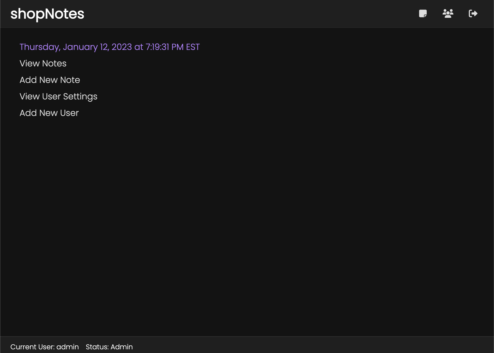
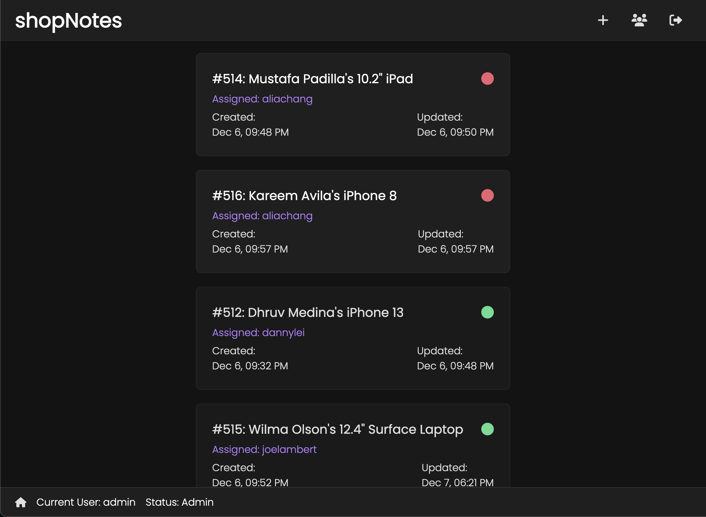
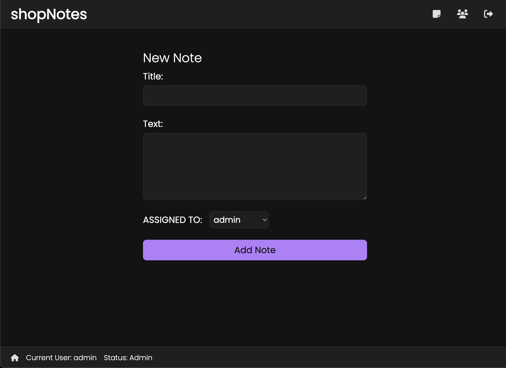
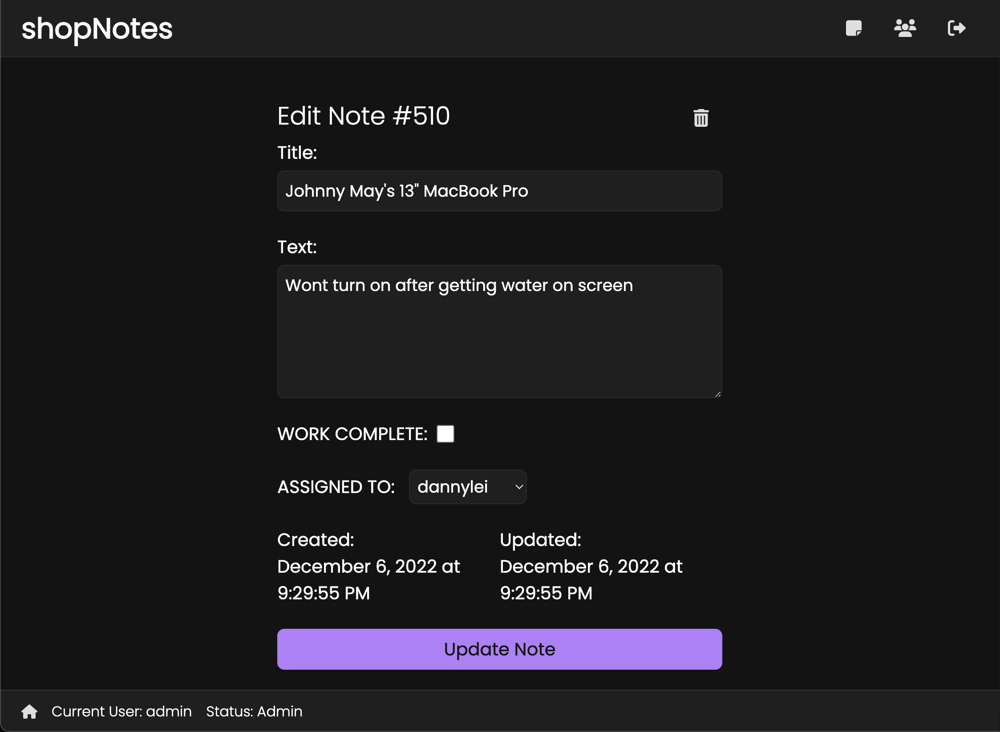
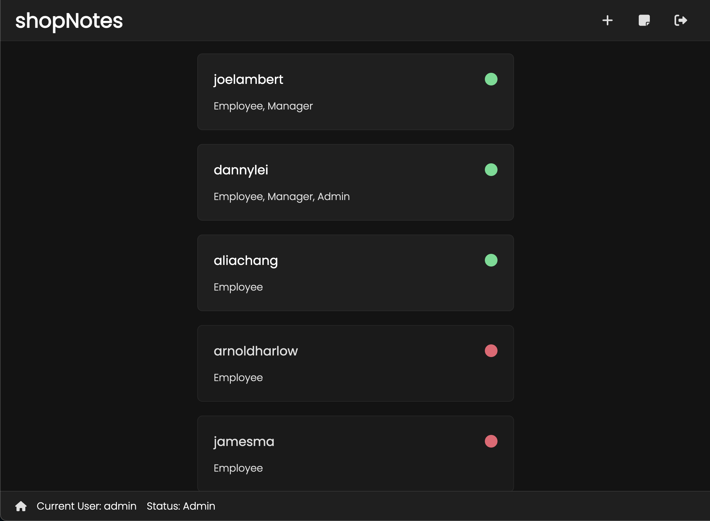

# shopNotes

<a href="https://jyl-notes.onrender.com/">Live App</a> • 
<a href="https://github.com/jianylei/notes_app_backend">Back end</a> 

## Introduction
"JYL Repairs" currently uses an archiac sticky note system to track all their repair notes. shopNotes was created to replace the old system, organizing all notes in a central database while bringing in functionalities to improve employee workflow and efficiency.

## Tech
React, JavaScript, Node.js, Express.js, Redux, MongoDB, HTML/ CSS

## Features
<ul>
  <li>Employee login system - with accounts created by admins/managers</li>  
  <li>Employees can create notes and assign them to the appropriate personel</li>  
  <li>Employees can only view notes assigned to them</li>  
  <li>Managers/admins have the ability to create/read/update/delete notes</li>
  <li>Notes can be marked as "completed" once task is finished</li>
  <li>Easy navigation</li>
  <li>Responsive UI for desktops & mobile</li> 
</ul>

## Screenshots
### Home

### Notes

### Create Note

### Update Note

### Users

